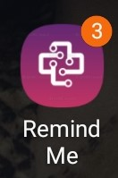
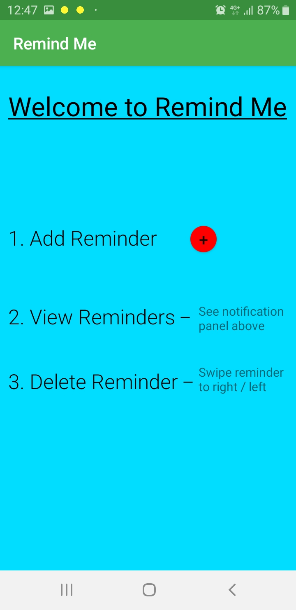
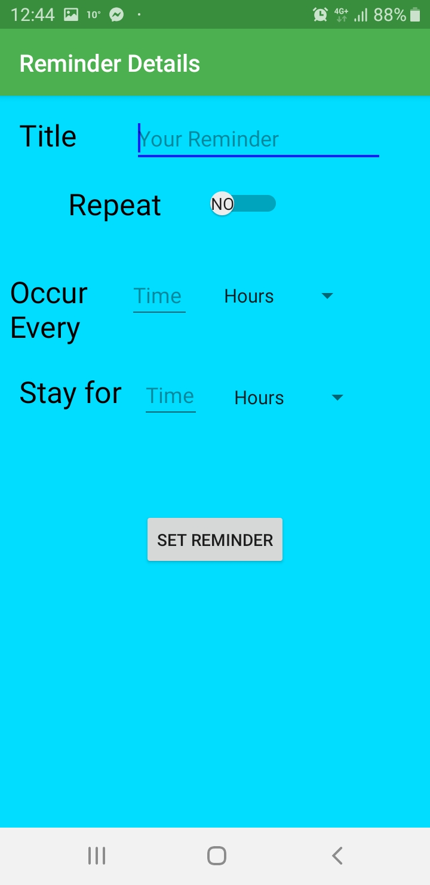
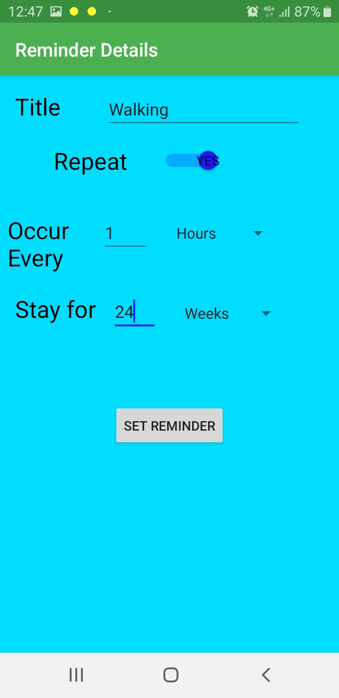
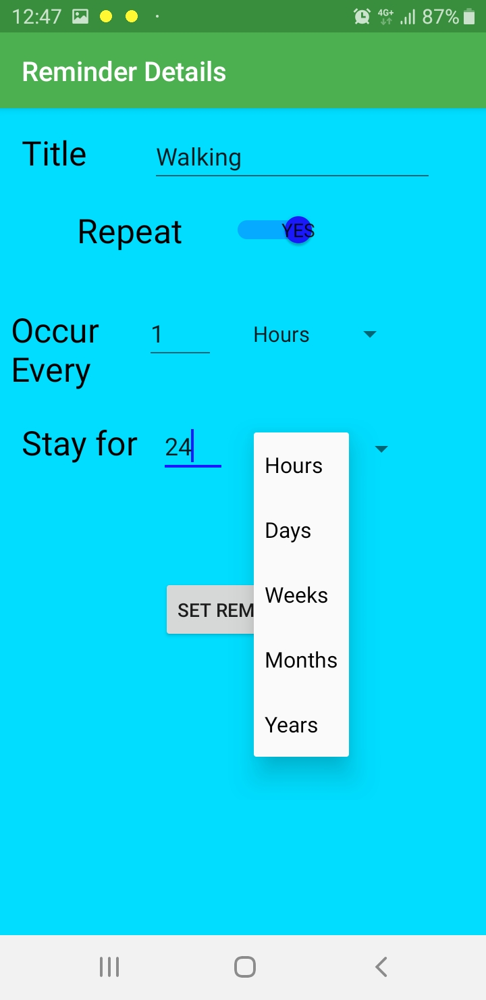
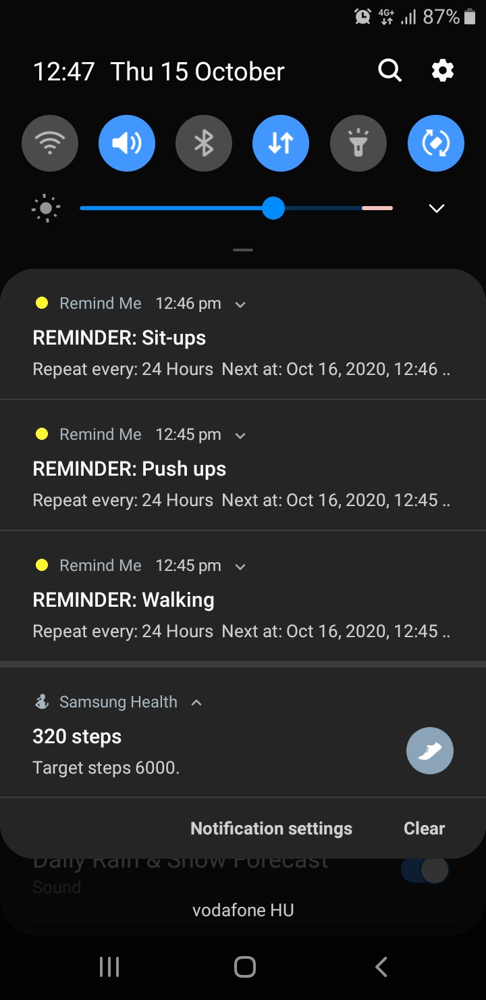

Documentation - RemindMe
========================

## Author- Adam Tacsik
This app is servicing for my BachelorThehis in a way to do certain tasks at a certain time. Basically most of people put on some weight during the time of the quarantine. Some people lose their job and some of them forced to do work at HomeOffice. This lead many people staying at home, furthermore the time spent with motion significantly has been decreased. As the lifestyle of people changed to some extent, as the working hours of a day has been increased. The point of this app to force the HomeOfficers to do some motion task, thus, they can interrupt their work, this way they can do some exercises between certain period of times (walking etc..)

Remind Me is an Android App, created using the Android Studio IDE. It is basically a Reminder App which asks for the 
content of the Reminder that the user wants to put up, whether the user wants the notification  to repeat(update) after
a certain time or not and also how long the user wants the Reminder to stay in their notifications. On clicking the
"Set Reminder" button, the reminder is set as a notification and appears in the notification panel along with the time
at which the reminder is to be updated next(if given by user) and the deadline for the reminder.

  
  
  

Multiple Reminders can be set using the app at a time and can be viewed in the notification panel. The notifications have
been given a high priority so that they will always appear on top of all notifications and also appear if the phone is 
locked.  

To Delete the reminder all you have to do is just swipe right/left to remove the notification.  

The .apk file of the app is along with this README. Just install the .apk file to use the app.  

